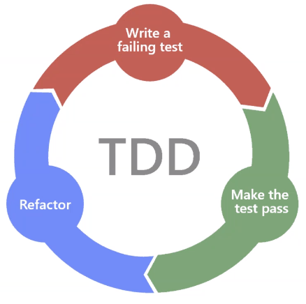

# Test Driven Development

Normally with software development, code is written and then tested. With TDD, specific unit tests are constructed first (designed to fail), and then the code is written to pass these tests. Only when the code has passed every test is it approved and goes live.

Tests can give developeres the confidence when refactoring code, as they are more likely to catch bugs due to the instant feedback when tests are executed.




## Types of Testing
- Unit testing
- TDD

## Testing in Python
- pytest (requires installing)
- unittest (already installed)

## Why TDD
- TDD helps us minimise the risk of failure before sending the product to production


**Steps**
- Create a file to write tests
- Run the tests and they will all fail (``pytest`` in terminal)
- For more detailed descriptions
```
pytest -v
python -m unittest discover -v
```
- Create a file to write code
- Refactor and add the code to pass the tests

**Naming Convention**
- mainfile: simple_calc
- testfile: test_simple_calc (should contain test at beginning or end)
- If tests are defined as methods on a class, class name should start with _Test_ (e.g. ``TestExample``), class should not have an init method
- Test methods/functions should begin with ``test_`` (e.g. ``test_example``)

**Example Test Class**
```python

# unittest.TestCase works with unittest framework as a parent class
class TestCalc(unittest.TestCase):
    calc = SimpleCalc()
    
    # start each method with keyword test_
    def test_add(self):
        # returns True if 2 + 4 returns 6, otherwise False
        self.assertEqual(self.calc.add(2, 4), 6)

```

### How does pytest work

- pytest looks for files with ``test_*.py`` or ``*_test.py`` format to run 
- ``-v`` is for verbose flag, adds more details in the test report
- Can use different test conditions (e.g. ``assertEqual()``) as required